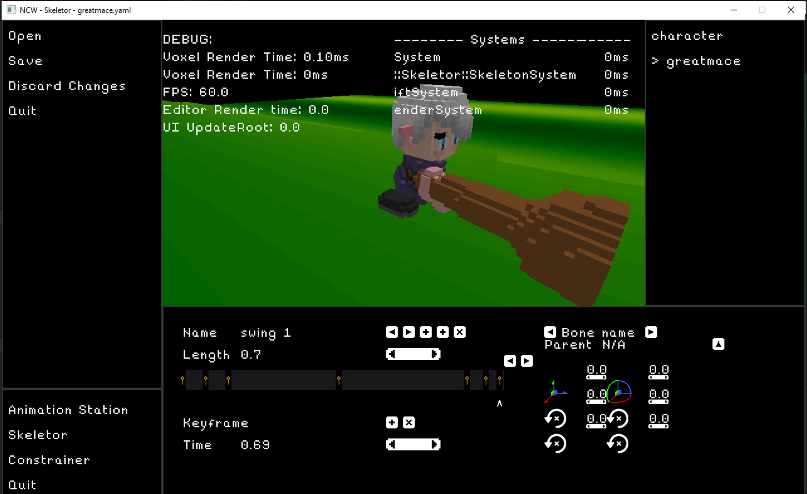

# Not Cube World

This is my attempt to recreate some of the magic I found in the mysteriously-gone [Cube World](https://picroma.com/cubeworld).
There are [lots](https://www.youtube.com/watch?v=rhk5-cHPXwM) of [examples](https://www.youtube.com/watch?v=sRjav_bkZXY) of
[this](https://www.youtube.com/watch?v=JoRSgFxX0HA&list=PL2XncHqN_7yLUBEILKAinFEODMBtaIfmv), but [Cube World](https://www.youtube.com/watch?v=yM2mHIV3TgI)
was a super [fun](https://www.youtube.com/watch?v=N01LOl-Q8EE), [voxel-based](https://www.youtube.com/watch?v=xdOkTI-P6yU),
[randomly-generated](https://www.youtube.com/watch?v=clXvI57npNg), [adventure](https://www.youtube.com/watch?v=-wnTFW0iH0Q)
[RPG](https://www.youtube.com/watch?v=Qxfvrc2VPik).
Unfortunately, it [disappeared](https://www.youtube.com/watch?v=uxPclAOohDA) off the face of the earth and
[confused everyone](https://www.youtube.com/watch?v=APxEiZtMpkA). There has not been
a single update since 2013 and even the [head dev](https://twitter.com/wol_lay) has appeared to go silent in the last year.

But I miss Cube World. I want to play it again. And ever since I heard `wol_lay` wrote it [entirely in C++](https://www.reddit.com/r/CubeWorld/comments/68yexy/what_engineframework_is_cubeworld_made_in/),
I've kind of wanted to do the same. Considering I know it's fun, it's clearly possible to create in homebrew C++,
and all the data is stored in files called `data1.db` ([sqlite specifically](https://www.sqlite.org/index.html), in case you care),
Cube World seemed like the perfect starting point for doing a game engine from start to finish.

## Things

Right now there are two "things": the Game and the Editor. Editor, as the name implies, is intended to be the place for making content for the Game, which is what people will play.

### Editor Reference

If you're going to change up things such as the UI, it's good to know what to expect. Since there are no tests, use this reference image as a handy-dandy "what should the Editor look like at all times?" guide:



## How to develop

1. Make sure you can see [the Trello board](https://trello.com/b/X0QjsQet/not-cube-world).
2. Use either Mac or 64-bit Windows.
3. (Editing models) Download [MagicaVoxel](https://ephtracy.github.io/). Refer to [Editing Models](#editing-models) for setup info.

### Windows-Specific

1. Install [Visual Studio 2019](https://visualstudio.microsoft.com/downloads/) for easier development (not required).
2. Use `fbuild` to build the solution: `FBuild.exe CubeWorld-sln`.
3. The solution can be found at `tmp/VisualStudio/CubeWorld.sln`
4. Building from command line: run `FBuild.exe All`.

### Mac-Specific

1. Get `clang v10.0.0`. This can be checked by running `clang -v`. If you can't upgrade, I have no idea if it'll work. #YOLO
2. Building from command line: run `FBuild All`.
3. (VS Code) Install [Visual Studio Code](https://code.visualstudio.com/). The `.vscode` folder defines some useful macros for rebuilding cmake and running the game or editor.
4. (XCode) Use `fbuild` to create the XCode solution: `FBuild CubeWorld-sln`. The solution can be found at `tmp/XCode/CubeWorld.xcodeproj`

### Running the game

#### Visual Studio (Windows)

Set "Editor" or "Game" as your startup project and hit F5, or Debug.

#### VS Code (Mac)

If you have the [C++ Extension](https://github.com/Microsoft/vscode-cpptools) installed and this file is at the base of your workspace, you should also be able to hit F5 to debug the Editor.

To change what gets launched, modify `.vscode/launch.json`.

#### Manually

After building either the `Game` or `Editor` targets, navigate to `tmp/OSX-Debug/{target}` and run the executable from there.

```bash
Game$ ./Game
```

Working directory is important!!! If the working directory doesn't have `Assets` in it, you may see the following:

```bash
$ ./build/source/Editor/Editor
INFO  | Vendor: ATI Technologies Inc.
INFO  | Renderer: AMD Radeon Pro 460 OpenGL Engine
ERROR | Failed to clean up font face
Assertion failed: (maybeFont), function Controls, file /Users/tsteinke/CubeWorld/source/Editor/Helpers/Controls.cpp, line 33.
[1]    53081 abort      /Users/tsteinke/CubeWorld/build/source/Editor/Editor
```

In this case, just navigate to the directory where the executable lives.

### Editing Models

To exit the models, instead of using a handrolled editor I've moved to using [MagicaVoxel](https://ephtracy.github.io/). It's very clean and useful - check it out. Once you've downloaded the tool, in order to modify the models in the game change the file located at `<Magica-Voxel-Dir>/config/config.txt`:

```
workspace
(
   // notice :
   // 1. use '$' for current directory, otherwise use full path
   // 2. use single '/' or '\' in the path
   // 3. don't have empty space at ends of the path

   dir_model      = [[/path/to/CubeWorld/Assets/Models]]
   dir_pattern      = [[/path/to/CubeWorld/Assets/Models]]
   dir_palette      = [[/path/to/CubeWorld/Assets/palette]]
   dir_export      = [[/path/to/CubeWorld/Assets/Models]]
   dir_snapshot      = [[$/export]]
   dir_xs_shader      = [[$/shader]]
)

...
```

## Repo Layout

Here are the important folders:

- `Assets` -
   just like in Unity, all of this folder is copied into the game's location and contains all the assets to be loaded at runtime.

- `build`
   doesn't exist in the repo, but it's where your game should be built to and run from.

- `dependencies`
   has everything (excluding `json.hpp` lol) that we didn't create resides here.

- `source`
   All the CODE. Each folder within this one represents a different project,

   - `DataCLI`

      Doesn't really do a whole lot. I wrote it in order to extract the `.db` files mentioned above into all the premade asset files.

   - `Editor`

      Resembles `Game`, in that it draws from `Shared` and runs off the `Engine` code in the same way. This is going to be for asset viewing, modification, and in an ideal world doing most, if not all, of the game creation work.

   - `Engine`

      Above `Shared`, holds all the code I would expect any game that wants to use a game engine to need. Includes generic input, Entity-Component-System logic, audio, etc.

   - `Game`

      The game itself. Gets built into an executable that you'll use to actually play the game.

   - `Library`

      Common libraries, one step up above `Engine`.

   - `Sandbox`

      I dunno. Good for mucking around with C++ if you don't want to set up a new project.

   - `Shared`

      All the code shared by both Game and Engine. Gets compiled into a `Shared` static library that's then compiled into `Game` and `Engine`.

## Concepts

### Entity-Component-System

The [Entity-Component-System](https://en.wikipedia.org/wiki/Entity%E2%80%93component%E2%80%93system) paradigm is both a good way for organizing the data we are working with in an efficient way with both data, as well as a great way to decouple game logic and make it incredibly understandable. However, it's [easily misunderstood](https://shaneenishry.com/blog/2014/12/27/misconceptions-of-component-based-entity-systems/). In a nutshell, ECS has three core components ([read more](https://www.gamasutra.com/blogs/TobiasStein/20171122/310172/The_EntityComponentSystem__An_awesome_gamedesign_pattern_in_C_Part_1.php)).

All the logic for ECS is defined in the following files:
- `source/Engine/Entity/Component.{h|cpp}`
- `source/Engine/Entity/ComponentHandle.h`
- `source/Engine/Entity/Entity.h`
- `source/Engine/Entity/EntityManager.{h|cpp}`
- `source/Engine/System/System.{h|cpp}`
- `source/Engine/System/SystemManager.{h|cpp}`

#### Entity

An `Entity` is simply an ID, which serves as an index for locating the component data attached to it.
Along with the `EntityManager`, which manages all `Entities` and attached `Component`s, the concept of an `Entity` provides
an interface for accessing the actual data (held in `Component`s) as well as iterating over all entities in the world.

Most notably, the `EntityManager` provides a way to iterate over a specific _group_ of entities, depending on
what components they have. For example, in order to perform a specific piece of logic on every `Entity` with a
`Transform` and `PhysicsBody` component, you would do the following:

```c++
mEntities.Each<Transform, PhysicsBody>([&](Entity e, Transform& transform, PhysicsBody& body) {
   // Contents of lambda, presumably making use of those components...
});
```

#### Component

As alluded to earlier, a [`Component`](http://gameprogrammingpatterns.com/component.html) is little more than a set of data
that can be attached to an entity. Often, a component is created for one specific system, but the magic of Systems is that
they can make use of any component that exists.

Example creation of a component:

```c++
struct Position : public Component<Position> {
   Position(float x = 0.0f, float y = 0.0f) : x(x), y(y) {}

   float x, y;
};
```

#### System

A System does all the per-frame logic of a specific state. It boils down to a class for each piece of game logic, which can
be selectively added or removed by a State depending on what logic you want. Here are the touchpoints of one system, `FlySystem`,
which does the work of flying the player (or any entities containing the `FlySpeed` component) around the map:

`source/Shared/Systems/FlySystem.h`
```c++
struct FlySpeed : public Engine::Component<FlySpeed> {
   FlySpeed(double speed) : speed(speed) {};

   double speed;
};

class FlySystem : public Engine::System<FlySystem> {
public:
   FlySystem(Engine::Input::InputManager* input) : mInput(input) {}
   ~FlySystem() {}

   void Update(Engine::EntityManager& entities, Engine::EventManager& events, TIMEDELTA dt) override;

private:
   Engine::Input::InputManager* mInput;
};
```

`source/Shared/Systems/FlySystem.cpp`
```c++
void FlySystem::Update(Engine::EntityManager& entities, Engine::EventManager&, TIMEDELTA dt)
{
   // ...

   entities.Each<Engine::Transform, FlySpeed, BulletPhysics::Body>([&](Engine::Entity, Engine::Transform& transform, FlySpeed& fly, BulletPhysics::Body& body) {
      // Figure out what direction to fly the character
      transform.SetLocalPosition(transform.GetLocalPosition() + dt * direction);
   });
}
```

`source/Game/States/StupidState.cpp`
```c++
StupidState::StupidState(Engine::Window* window) : mWindow(window)
{
   DebugHelper::Instance().SetSystemManager(&mSystems);
   mSystems.Add<CameraSystem>(Engine::Input::InputManager::Instance());
   mSystems.Add<AnimationSystem>(Engine::Input::InputManager::Instance());
   mSystems.Add<FlySystem>(Engine::Input::InputManager::Instance());
   // ...

   mSystems.Configure();
}
```

### Events

Coming soon (tm)

## Resources

A lot of inspiration was drawn from [https://github.com/alecthomas/entityx/](https://github.com/alecthomas/entityx/).
